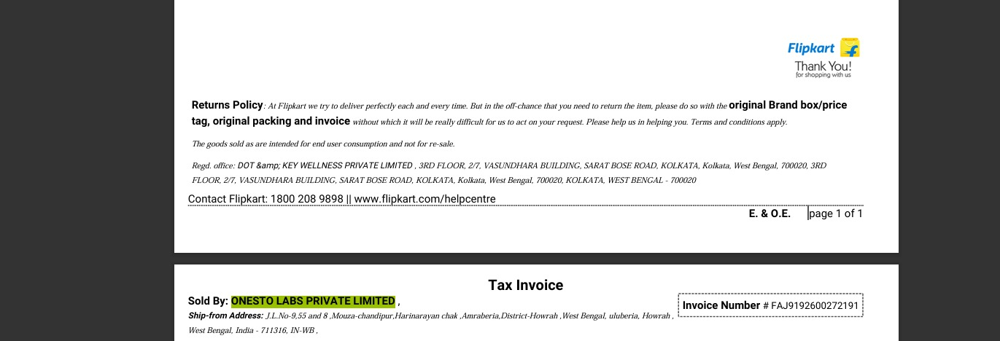
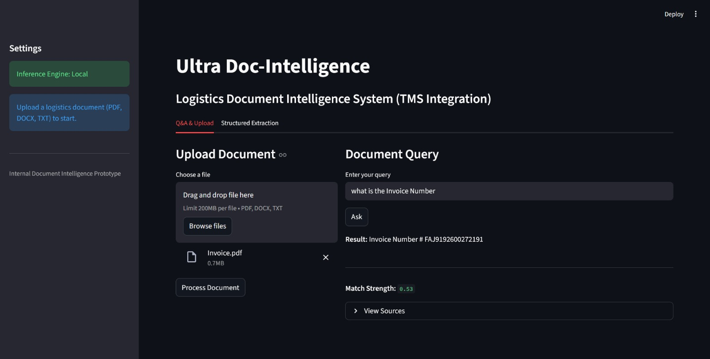

# Ultra Doc-Intelligence

A document-centric Retrieval Augmented Generation (RAG) system designed for logistics and Transportation Management Systems (TMS).  
This project focuses on **grounded answers**, **confidence scoring**, and **hallucination control** using local embeddings and inference.

---

## Overview

Ultra Doc-Intelligence allows users to:
- Upload logistics documents (PDF, DOCX, TXT)
- Ask questions strictly grounded in document content
- Extract structured shipment data
- Receive confidence scores for every answer

The system is built as a **backend-first application**, with a lightweight frontend for interaction.

---

## Architecture

```
Frontend (Streamlit)
|
v
Backend (FastAPI)
|
v
Vector Store (FAISS)
|
v
Local LLM (Ollama - llama3)
```

---

## Demo Screenshots

<p align="center">
  
</p>

<p align="center">
  
</p>

---

### Components
- **FastAPI Backend** – Handles ingestion, retrieval, guardrails, and inference
- **FAISS Vector Store** – Local similarity search using sentence embeddings
- **Sentence Transformers** – `all-MiniLM-L6-v2` for embeddings
- **Ollama (llama3)** – Local inference, no paid APIs required
- **Streamlit Frontend** – Simple UI for upload, Q&A, and extraction

---

## Document Processing

- Supported formats: **PDF, DOCX, TXT**
- Documents are split using a recursive chunking strategy
- Chunks are embedded and stored locally in FAISS

Chunking configuration:
- `chunk_size = 800`
- `chunk_overlap = 100`

This preserves structure commonly found in logistics documents like invoices, rate confirmations, and bills of lading.

---

## Retrieval & Guardrails

### Retrieval
- FAISS `IndexFlatL2`
- Top-k = 4 most relevant chunks

### Guardrails
Before generating an answer:
1. **Similarity Threshold**  
   If retrieval similarity is too low → answer is refused
2. **Confidence Threshold**  
   Aggregate confidence must pass a minimum score
3. **Pre-Generation Enforcement**  
   LLM is never called if retrieval is weak

This ensures **no hallucinated responses**.

---

## Confidence Scoring

Confidence is calculated deterministically:

``` confidence = 0.6 × max_similarity + 0.4 × avg_similarity ```


- Distance → similarity mapping: `1 / (1 + distance)`
- Output range: `0.0 – 1.0`
- Returned with every answer

---

## Structured Data Extraction

The system can extract structured logistics fields such as:
- shipment_id
- shipper
- consignee
- pickup_datetime
- delivery_datetime
- equipment_type
- mode
- rate
- currency
- weight
- carrier_name

If a field is missing, it is returned as `null` to ensure schema stability.

---

## API Endpoints

| Method | Endpoint | Description |
|------|---------|------------|
| POST | `/upload` | Upload document |
| POST | `/ask` | Ask a grounded question |
| POST | `/extract` | Extract structured data |

---

## Running Locally

### Prerequisites
- Python 3.9+
- Ollama installed and running
- Model pulled:
```bash
ollama pull llama3
```

---

## Backend
```bash
pip install -r requirements.txt
uvicorn backend.main:app --reload
```
Runs on:
http://localhost:8000

---

## Frontend
```bash
streamlit run frontend/app.py
```

---

## Design Goals

- No external paid APIs
- Deterministic, explainable behavior
- Interview-ready architecture
- Clear separation of concerns
- Production-style error handling

---

## Hosted UI & Deployment Note

This project uses **Ollama (llama3) for local LLM inference** to ensure:
- No external paid APIs
- Deterministic behavior
- Data privacy

Because Ollama requires a local runtime, the backend is **intentionally not deployed publicly**.

The system is fully runnable locally:
- FastAPI backend
- Streamlit UI
- FAISS vector store
- Local LLM inference


